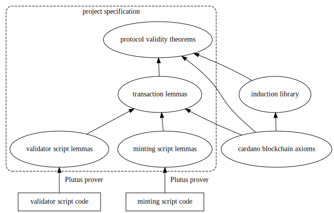

# Plutus Specification Language

## Motivation

Smart contracts within Cardano consist of scripts that control how
*UTXOs*, pieces of *value* with an associated *datum* (piece of data), can
be consumed by transactions. Unlike Ethereum and such, the script has very limited power
and can only do local inspection of the consuming transaction. This means that the
implementation of the contract, i.e. the script, is often divorced from the
desired semantics. It is generally non trivial to decipher the *intention*
of a smart contract from its raw implementation.

Our goal is to create a language in which we can describe the semantics of our
system in its entirety, from an inter-transaction perspective rather than
an intra-transaction perspective. Specifically, we describe the *token flow*.

A "dapp" on Cardano is essentially defined by the way tokens can flow between
UTXOs.
Let's say we have a game of chess on the blockchain, where
a token C represents the chessboard, and tokens B and W represent
the *right* to make a play for that player.
In the UTXO that locks C, we contain the game state and also
funds that will go to the winner.
However, we will have many scripts that interplay even in this
simple scenario:
We will have at least one minting policy for the three tokens.
We will have at least one validator for controlling the output
with C.

For this dapp we want the following property:
- There is always a sequence of transactions that will unlock
  the funds locked in a valid chess UTXO.

In truth, this property applies to most dapps that build on Cardano.

Our specification language consists of a way of specifying transactions and
combinations of transactions and the conditions under which they should validate.

Using this, we can create a "rule" that says any transaction that consumes a
UTXO that is a valid chessboard, it must also output exactly one
updated *valid* version of that chessboard, unless of course the game is finished.

However, we need one more rule:
We must also for any UTXO with a valid chessboard, be able to *construct* a transaction
that consumes it, provided that we have the necessary tokens to progress the game.

With these two rules, if we assume that a game of chess will eventually end,
and that both players keep playing, then we can show that this
"dapp" will always progress and eventually end, returning the
locked funds to whoever won.

(For obvious reason, the assumption that both players keep playing obviously doesn't
hold, as it would not be economically beneficial for them to play a game
they are going to lose.)

The difference between the logic expressed here and the logic expressed in the script,
is that the script merely tells you whether a transaction fails.
It does not tell you whether a transaction succeeds, because there is
often more than one script. In addition, it does not specify
the *combination* of scripts necessary for a transaction to succeed,
nor does it guarantee that there even is a transaction that
can consume the input.

## General design

The motivation for this language is to make plutus specifications, rigorous,
precise, easy and unambiguous. The language consists of two layers:

  1. a UTXO-level specification
  2. higher-level compositions of lower-level specs through abstraction and application




## Language

```
t0 = ...

t1 = ∀ { n : Int : n > 10 and n < 20, b : Bool }
   . { inputs: utxos                 -- list of UTXO inputs
     , outputs: utxos                -- list of UTXO outputs
     , validator:
        if b
          then n < 12
          else true
     , effects: effect               -- list of effects produced by this transaction
     , signatures: pubkey ↦ sig      -- map from pubkey hashes to transaction signatures
     , range: (expr, expr)           -- time range, specified as a tuple of slot numbers
     , ?fee: expr                    -- fee amount in Ada, optional field
     }


v1 =

tCombined = ∀ (r : Bool) (g : Bool) (b : Bool)

1. show equivalence between utxo validators + minting validators <=> transaction validators
  v1 and v2 <=> txnValidator
2. show equivalence between compositions of transaction validators <=> higher-level props
  t15 = t1 r -> t2 r -> (t3 r | t4) -> t5 :: forall r@{x: int} . ( ... )
  t16 = ...

  t15 -> t16 :: forall . (stuff I want) and not (stuff I don't want)

  forall (t : Transaction) .
    {
      inputs: t.outputs[i],
      outputs:
        { validator: ..., value: ..., datum: ... }
      validator: (v t.ouputs[1]) and ...
    }

v = \{address,...} -> ...
```

Our first-order speccing language:

```
spec ::=
  txn-def*
  validator-def*

-- transactions

txn-def ::=
    T = txn-expr                      -- transaction binding

txn-expr ::=
    abs . txn-expr                    -- transaction abstraction
  | quantifier-list .                 -- variable introduction, including redeemer inputs
      { inputs: utxos                 -- list of UTXO inputs
      , outputs: utxos                -- list of UTXO outputs
      , effects: effect               -- list of effects produced by this transaction
      , signatures: pubkey ↦ sig      -- map from pubkey hashes to transaction signatures
      , range: (expr, expr)           -- time range, specified as a tuple of slot numbers
      , ?fee: expr                    -- fee amount in Ada, optional field
      }
  | txn-expr -> txn-expr              -- sequential composition
  | ( txn-expr | txn-expr )           -- parallel composition
  | txn-expr : validator-expr         -- transaction validation
  | T                                 -- transaction variables

abs ::=
  λ(U : UTXO)* (T : Transaction)* (x : τ : ?expr)*    -- abstraction over transactions, utxos or values

quantifier-list ::=
  ∀ (x : τ : ?expr)*

-- UTXOs

utxos ::=
    utxos , utxos
  | utxo
  | ?utxo                           -- optional utxo

utxo ::=
  {
  , address: expr                -- validator scripts
  , value: φ,tok ↦ expr             -- token bundle
  , ?datum: (expr : τ)
  }

validator-def ::=
    v = validator-expr              -- validator definition

validator-expr ::=
  | abs . validator-expr            -- validator abstraction
  | validator x                     -- validator application to values
  | validator T                     -- validator application to transactions
  | validator U                     -- validator application to utxos
  | v                               -- validator variable
  | expr                            -- (boolean) expression

effect ::=
    mint φ tok expr                 -- mint expr tokens under minting policy φ
  | burn φ tok expr                 -- burn expr tokens under minting policy φ
  | effect , effect                 -- effect sequencing

policy ::=
  φ = quantifier-list . expr        -- spec for a minting policy

policy-id ::= φ

expr ::=
    x                               -- var
  | T                               -- transaction variable
  | T.outputs[i]                    -- UTXO reference
  | expr.datum                      -- where expr evaluates to a UTXO
  | quantifiers . expr              -- abstraction
  | expr expr                       -- application
  | expr + expr                     -- arithmetic
  | expr - expr
  | validator-expr                  -- use of other validators
  | ...
  | expr <> expr
  | expr and expr                   -- logical operators
  | expr or expr
  | not expr
  | currentSlot                     -- timeslots
  | cons expr expr                  -- lists
  | ...
  | ( expr )                        -- grouping
  | "..."                           -- string literals
  | [0-9]+                          -- integer literals
  | r@{ l1: expr, ..., ln: expr }   -- row expression
  | any                             -- any value (of any type)

τ ::=
    Int
  | Bool
  | String
  | ByteString
  | [τ]                             -- lists
  | (τ, τ)                          -- type conjunction
  | C τ \/ C τ                      -- type disjunction / variants
  | rt@{ l1: τ, ..., ln: τ }        -- row expression
  | Transaction                     -- transaction types
  | UTXO                            -- UTXO types

rulename ::= x

num ::= [0..9]+
string-literals ::= "..."

with the following meta-variables:

    σ ranges over specifications
    T ranges over transaction variables
    U ranges over UTXO variables
    α ranges over addresses
    τ ranges over types
    r ranges over row variables
    rt ranges over row type variables
    φ ranges over minting policies and indicates the type of token
    C ranges over data constructor names
    x ranges over variable names (a-z, A-Z, 0-9, _)
    i ranges over positive integers
    txn is a built-in variable that references the currently pending transaction in a validator expression
    tok ranges over token names
    pubkey ranges over public key hashes
    sig ranges over signatures
    slot ranges over block numbers
```

## Higher-Order Speccing Language

We extend our speccing language to include higher-order specifications
using the following constructs:

```
rules ::=
    ...
  | \(x : σ).rules  -- abstraction
  | rules rules     -- application
```

## Example

## Tooling

Currently there is no tooling around this language, but we have a number of ideas:

  1. test suite generator
  2. spec typechecking (ensuring specs are sound)
  3. symbolic execution engine to match the implementation (untyped plutus core)
     against the spec (with answers `Yes`, `No` with a reason, or `Maybe`)
  4. fuzzing tools
  5. model checking code generators
  6. other code generators to formal languages (e.g. Agda, Idris, Coq, etc)

