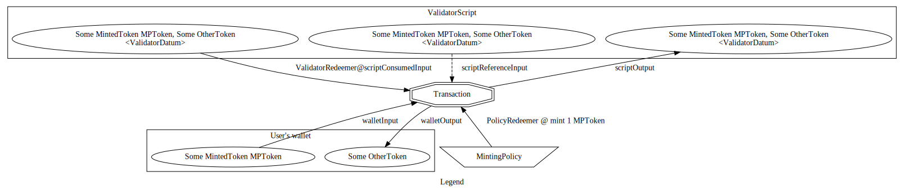
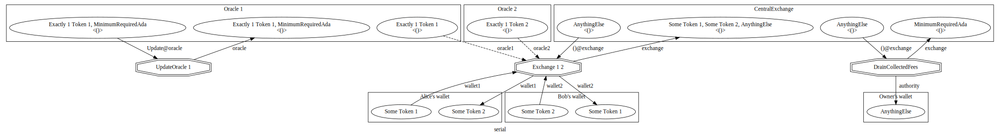

# Diagrams of transaction types

Once the transaction family is specified at the type level, we can import the `Family.Diagram` and `Family.Diagram.TH`
modules in order to automatically generate various diagrams of our transactions in various combinations.

~~~ {.haskell}
{-# LANGUAGE DataKinds, DuplicateRecordFields, OverloadedStrings, TemplateHaskell #-}
module Diagram where

import Control.Concurrent (forkIO)
import Family.Diagram (
  TransactionTypeDiagram,
  OverlayMode (Distinct, Parallel, Serial),
  transactionGraphToDot, transactionTypeGraph, transactionTypeFamilyGraph)
import Data.GraphViz (
  GraphvizCanvas (Xlib), GraphvizOutput (Canon, DotOutput, Svg),
  runGraphviz, runGraphvizCanvas')
import qualified Language.Haskell.TH as TH
import Family.Diagram.TH (diagramForTransactionType, untypedDiagramForTransactionType)
import qualified HKD
import qualified Legend
~~~

The diagrams in question represent transactions as double octagons, scripts and wallets as UTxO-containing rectangles,
minting policies as trapesoids, and UTxOs as ovals. It's easier to explain as a legend:

First we generate some diagrams using the Template Haskell splices from `Family.Diagram.TH`:

~~~ {.haskell}
update, exchange, drain :: TransactionTypeDiagram
update = $( [t| 'HKD.UpdateOracle 1 |] >>= untypedDiagramForTransactionType)
exchange = $( [t| 'HKD.Exchange 1 2 |] >>= untypedDiagramForTransactionType)
drain = $$(diagramForTransactionType $ TH.PromotedT $ TH.mkName "HKD.DrainCollectedFees")
legend = $$(diagramForTransactionType $ TH.PromotedT $ TH.mkName "Legend.Transaction")
~~~

The function `diagramForTransactionType` and `untypedDiagramForTransactionType` generate a Template Haskell quote for
an expression of type `TransactionTypeDiagram`, which we can also generate manually if needed. Then we can convert the
diagrams to GraphViz either on their own, or combining multiple transaction types in a single graph. There are three
different modes of combinations at the moment: `Distinct`, `Parallel`, and `Serial`.

~~~ {.haskell}
main = do
  let g1 = transactionGraphToDot "exchange" (transactionTypeGraph 0 exchange)
      g2 = transactionGraphToDot "distinct" (transactionTypeFamilyGraph Distinct [update, exchange, drain])
      g3 = transactionGraphToDot "parallel" (transactionTypeFamilyGraph Parallel [update, exchange, drain])
      g4 = transactionGraphToDot "serial" (transactionTypeFamilyGraph Serial [update, exchange, drain])
  forkIO (runGraphvizCanvas' g2 Xlib)
  forkIO (runGraphvizCanvas' g3 Xlib)
  forkIO (runGraphvizCanvas' g4 Xlib)
  runGraphviz g4 Canon "update-exchange-drain.dot"
  runGraphviz (transactionGraphToDot "Legend" (transactionTypeGraph 0 legend)) Svg "legend.svg"
~~~

The serial mode appears to be the most intuitive of the three. That particular output of this sequence can be seen
below.

